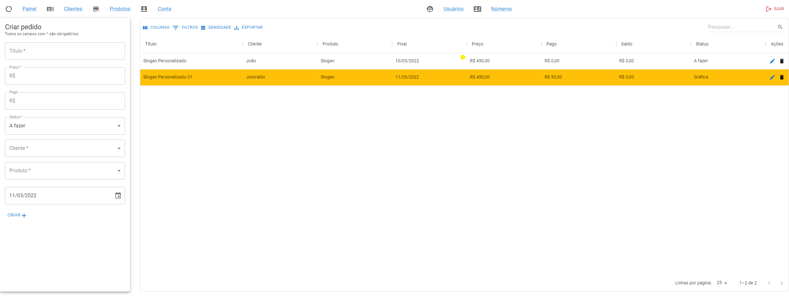
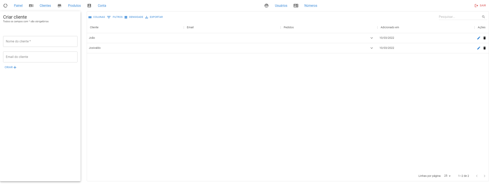
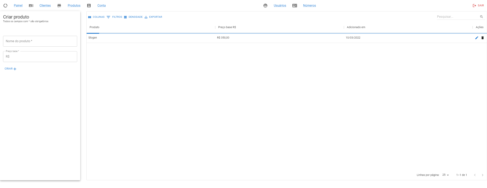

<h1 align="center">
    
</h1>

# RequestSave

A proposta deste projeto era criar um aplicativo Fullstack usando Node.js para o desenvolvimento do backend e React.js para o desenvolvimento do frontend.

Basicamente é um web app onde podemos entrar com nossa conta, registrar, esquecer a senha, reenviar o email de confirmação e etc.
Mas para o registro ocorrer é necessário que um Administrador da plataforma tenha registrado seu número no banco de dados, assim no momento de registro de uma nova conta é necessário por o mesmo número.

Ao entrar na plataforma, temos acesso ao menu que nos leva para as abas Painel, Cliente, Pedido e Conta para o caso de um Usuário, e para o caso de um Administrador é acrescentado mais dois botões de Usuários e Vínculos.

E então podemos fazer operações CRUD com maior parte dos dados, com excessão de algumas coisas, como alterar o nome do Usuário.

[RequestSave](https://requestsave-client.herokuapp.com/login)
[API](https://requestsave-server.herokuapp.com/api)

## Como testar

Coisas necessárias antes do procedimento:

- Yarn
- Windows
- MYSQL

Obs: Execute os comandos abaixo no root do projeto.

1. `yarn global add dotenv-cli`
2. `yarn global add nodemon`
3. `yarn install`
4. Configure as variáveis de ambiente
5. `yarn  dev:migration`
6. `yarn development`
7. Abrindo na página <http://localhost:PORT/login>, faça login com o email e senha "admin"

## Rotas da API

#### Rotas para a conta

| Ação                        | Rotas                                    |
| :-------------------------- | :--------------------------------------- |
| login                       | /api/account/login                       |
| logout                      | /api/account/logout                      |
| delete                      | /api/account                             |
| edit                        | /api/account                             |
| register                    | /api/account/register                    |
| confirmRegistration         | /api/account/confirmregistration         |
| resendRegisterConfirmation  | /api/account/resendregisterconfirmation  |
| checkJWT                    | /api/account/checktoken                  |
| forget                      | /api/account/forgetpassword              |
| forgetResetpassword         | /api/account/forgetresetpassword         |
| resetpassword               | /api/account/resetpassword               |

#### Rotas para o administrador

| Ação                        | Rotas                                    |
| :-------------------------- | :--------------------------------------- |
| user                        | /api/panel/user                          |
| accountTie                  | /api/panel/accounttie                    |

#### Rotas para todos

| Ação                        | Rotas                                    |
| :-------------------------- | :--------------------------------------- |
| request                     | /api/panel/request                       |
| client                      | /api/panel/client                        |
| product                     | /api/panel/product                       |

## Imagens

### Tecnologias utilizadas

- Typescript
  - **React JS**
    - **React Query + Axios**
      - Para fazer requisições HTTP ao servidor de forma segura e otimizada
    - **React Router Dom**
      - Para fazer o roteamento das páginas
    - **Yup**
      - Para validação dos dados que serão enviados ao servidor
    - **Material UI + Material UI x-data-grid**
      - Para construção das telas de forma rápida e tabelas com muitas funcionalidades
    - **CSS**
      - Para fazer alterações de acordo com meu gosto

  - **Node JS**
    - **Express + express-async-errors**
      - Para a construção da API de forma ágil, e lidar com erros de forma limpa
    - **Dotenv**
      - Para o armazenamento de chaves
    - **Joi**
      - Para a validação de dados recebidos das requisições
    - **JWT**
      - Para criar sessões de login
    - **Prisma + MYSQL**
      - Para lidar com o banco de dados MYSQL de uma forma segura, otimizada e simples
    - **Bcryptjs**
      - Para a criptografia das senhas dos usuários
  